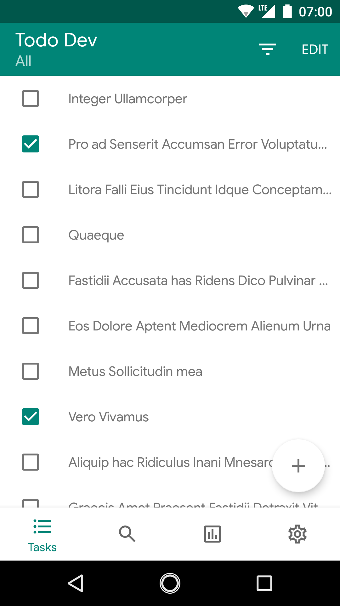
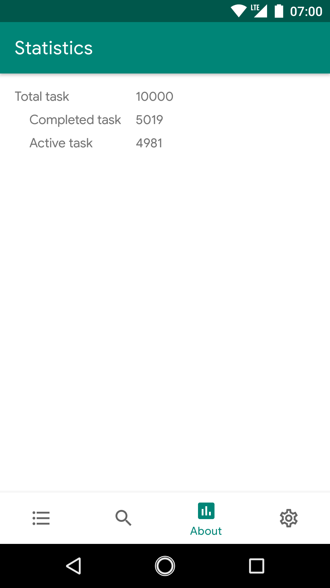
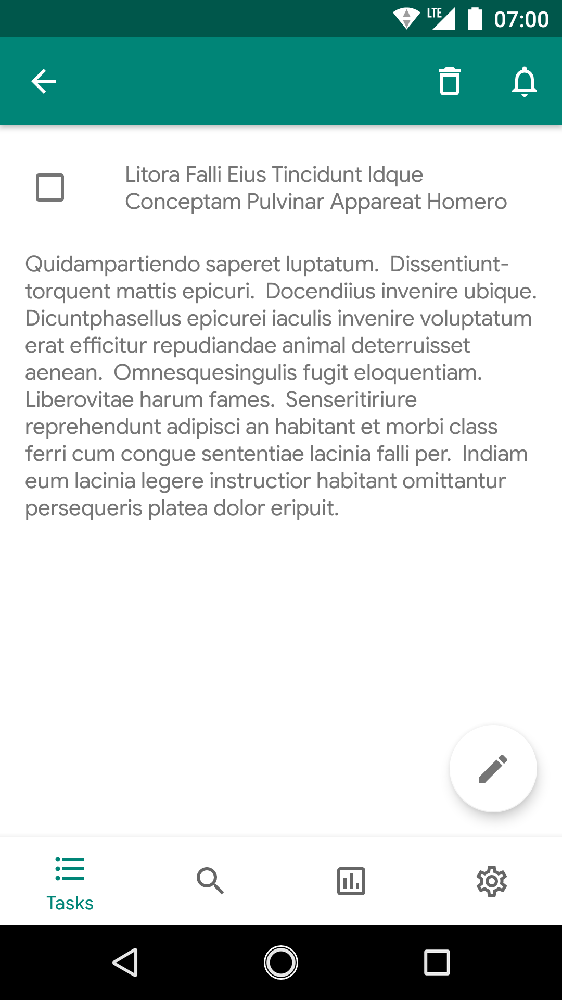

# Android sample

Introduction
-----------------
This is a sample app that using the Uncle Bob's clean architecture approach, alongside with the Android Architecture Components.

Coding style
-----------------
The standard style that described in https://developer.android.com/kotlin/style-guide  
This project uses a handy gradle plugin that will automatically format your code  
Use `./gradlew spotlessApply` to apply  

Overall architecture
-----------------
// insert image

Android Architecture Components
-----------------
* LiveData: lifecycle-aware observable data holder class  
* ViewModel: manage UI-related data, survive configuration changes such as screen rotations  
* DataBinding: bind UI components in your layouts to data sources  
* Navigation: this sample using the Single Activity approach, Android Navigation Component add an abstract layer to handle fragment transactions, Up and Back actions correctly combine with Safe Args plugin to generate fragment argument  
* WorkManager: manage deferrable, asynchronous tasks and when they should run. Use for seed database with sample data  
* Paging: load data gradually and gracefully  

Dependency Injection
-----------------
* Dagger2: primarily known for slow build time, this sample slipt the setup into multiple modules  
* AssistedInject: compatible with Dagger2, perform constructor injection to classes that need data/class/instance available only at runtime  
 
Contribution
-----------------
Android Studio: 3.5.0-canary2 or later  
All development process happens on the `development` branch, feel free to open a pull request, any change you make into this branch with automatically test, build and submit to google play beta track  
Opt-in URL: https://play.google.com/apps/testing/com.sample.todo  
Make sure to apply the style that described in the Coding style section  

      
